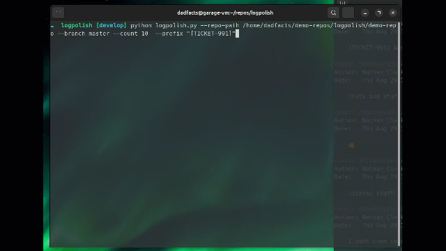

# 🌟 LogPolish: AI-Powered Git Commit Message

[](https://opensource.org/licenses/MIT)
[](https://www.python.org/downloads/)

Elevate your Git history with LogPolish - the intelligent CLI tool that transforms your commit messages using the power of AI!



## 🚀 Features

- 🤖 Leverages AI (Claude or OpenAI) to generate concise and informative commit messages
- 🔄 Interactive mode for reviewing and updating suggested messages
- 🔍 Diff viewer for informed decision-making
- 🏷️ Custom prefix support for standardized commit messages
- 🔐 Secure API key management with .env file
- 🔀 Supports multiple Git branches
- 🎨 Rich, colorful console output for better readability
- 🖥️ Cross-platform compatibility (Windows, macOS, Linux)

## 📋 Requirements

- Python 3.7+
- Git
- PowerShell (for Windows users)
- Bash or Zsh (for macOS and Linux users)

### Windows Users

LogPolish requires PowerShell for some operations on Windows. Most modern Windows systems come with PowerShell pre-installed. If you don't have PowerShell:

1. Open the Microsoft Store
2. Search for "PowerShell"
3. Install the application published by Microsoft Corporation

Make sure you can run PowerShell scripts by setting the execution policy. Open PowerShell as Administrator and run:

```powershell
Set-ExecutionPolicy RemoteSigned
```

Choose 'Y' when prompted.

## 🛠️ Installation

1. Clone the repository:

   ```
   git clone https://github.com/yourusername/logpolish.git
   cd logpolish
   ```

2. Install the required dependencies:

   ```
   pip install -r requirements.txt
   ```

3. Set up your API key:
   Run the script and follow the prompts to set up your Claude AI or OpenAI API key:
   ```
   python logpolish.py
   ```

## 💻 Usage

Basic usage:

```
python logpolish.py --repo-path /path/to/your/repo --branch main --count 5 --prefix "[FEATURE]"
```

Options:

- `--repo-path`: Path to the Git repository (default: current directory)
- `--branch`: Branch to analyze (default: HEAD)
- `--count`: Number of recent commits to analyze (default: 5)
- `--prefix`: Prefix to add to all commit messages (optional)

## ⚠️ Warning: Rewriting Git History

LogPolish modifies existing commit messages, which rewrites Git history. This is generally safe for local branches that haven't been pushed to a shared repository. However, if you've already pushed your commits, changing them can cause issues for other contributors.

Use LogPolish with caution on shared branches. If you must use it on a branch that others are working on, make sure to communicate with your team and have them rebase their work.

Remember: Never rewrite the history of public branches (like `main` or `master`) unless you're absolutely sure about the consequences and have coordinated with all contributors.

## 📘 How It Works

1. LogPolish analyzes recent commits in your specified Git branch.
2. It uses AI to generate improved commit messages based on the diff.
3. You can review, accept, update, or skip each suggested message.
4. Accepted messages are automatically applied to your Git history.

## 🎬 Demo

To see LogPolish in action, you can create a mock repository and run the tool on it. Here's how:

1. Create a new directory and initialize a Git repository:

   ```
   mkdir demo-repo && cd demo-repo
   git init
   ```

2. Create a README and make the initial commit:

   ```
   echo "# Sample Project" > README.md
   git add README.md
   git commit -m "Initial commit"
   ```

3. Add a main Python script:

   ```
   echo "def hello_world():\n    print('Hello, World!')" > main.py
   git add main.py
   git commit -m "Add main script"
   ```

4. Create a .gitignore file:

   ```
   echo "# Ignore virtual environment\nvenv/\n\n# Ignore pycache\n__pycache__/" > .gitignore
   git add .gitignore
   git commit -m "Add gitignore file"
   ```

5. Add a feature to the main script:

   ```
   echo "def greet(name):\n    print(f'Hello, {name}!')\n\ndef hello_world():\n    print('Hello, World!')" > main.py
   git add main.py
   git commit -m "Add greet function"
   ```

6. Create a requirements file:

   ```
   echo "requests==2.26.0" > requirements.txt
   git add requirements.txt
   git commit -m "Add requirements.txt"
   ```

7. Add a license file:

   ```
   echo "MIT License\n\nCopyright (c) 2023 Your Name" > LICENSE
   git add LICENSE
   git commit -m "Add MIT license"
   ```

8. Create a setup script:

   ```
   echo "from setuptools import setup\n\nsetup(\n    name='sample-project',\n    version='0.1',\n    py_modules=['main'],\n)" > setup.py
   git add setup.py
   git commit -m "Add setup.py for packaging"
   ```

9. Add a test file:

   ```
   mkdir tests
   echo "import unittest\nfrom main import greet\n\nclass TestGreet(unittest.TestCase):\n    def test_greet(self):\n        self.assertEqual(greet('Alice'), 'Hello, Alice!')" > tests/test_main.py
   git add tests/test_main.py
   git commit -m "Add unit test for greet function"
   ```

10. Update README with usage instructions:
    ```
    echo "# Sample Project\n\nA simple Python project demonstrating 'Hello, World!' and a greeting function.\n\n## Usage\n\n\`\`\`python\nfrom main import hello_world, greet\n\nhello_world()\ngreet('Alice')\n\`\`\`" > README.md
    git add README.md
    git commit -m "Update README with usage instructions"
    ```

Now, run LogPolish on this repository to see it in action:

```
python path/to/logpolish.py --repo-path . --count 10
```

## 🤝 Contributing

Contributions are welcome! Please feel free to submit a Pull Request.

## 📄 License

This project is licensed under the MIT License - see the [LICENSE](LICENSE) file for details.

## 🙏 Acknowledgements

- [Click](https://click.palletsprojects.com/) for the CLI interface
- [Rich](https://rich.readthedocs.io/) for beautiful terminal formatting
- [GitPython](https://gitpython.readthedocs.io/) for Git integration
- [Anthropic](https://www.anthropic.com/) and [OpenAI](https://openai.com/) for AI capabilities

## 🗑️ Uninstallation

You can uninstall LogPolish either manually or by using the provided uninstall script.

### Manual Uninstallation

1. Remove the LogPolish directory:

   ```
   rm -rf /path/to/logpolish
   ```

2. Remove the .env file if you want to delete your API keys:

   ```
   rm /path/to/.env
   ```

3. Optionally, uninstall the dependencies if you don't need them for other projects:
   ```
   pip uninstall -r requirements.txt -y
   ```

### Automated Uninstallation

We provide an `uninstall.py` script for easy removal of LogPolish:

1. Navigate to the LogPolish directory:

   ```
   cd /path/to/logpolish
   ```

2. Run the uninstall script:
   ```
   python uninstall.py
   ```

This script will remove the LogPolish files, the .env file, and optionally uninstall the dependencies.

---

Made with ❤️ by Nathan

Give your Git logs a polish with LogPolish! ✨
